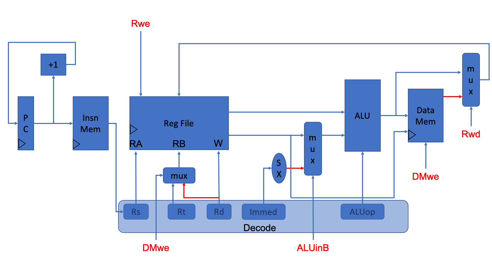

# Processor Checkpoint 1 -- R-type and I-type
### Team members: Wenxin Xu and Jin Zhou

Our design is shown in the Figure above with the reference of slide 14 in Lecture 8.

### Clock Design
As shown in the table below. Given the skeleton clock as clk, IMem and DMem will use clk as clock; PC and Register will divide the clk by four as their own clock.
| Component | Clock   |
| -------------  |:-------------:|
| PC           | clk/4 |
| IMem         | clk       |
| Register            | clk/4     |
| DMem            | clk  |

### Instruction Decode
With q_imem as input, decoding can be expressed as steps below:

1. Decode operation type: decide which instruction will be excuted, details can be found in `decode_op_code.v`.
2. `rt = q_imem[16:12]`, `rs = q_imem[21:17]`, `rd = q_imem[26:22]` and `Immed = q_imem[16:0]` are decoded for register and alu operations. 
3. `ALU_op = q_imem[6:2]` and `shamt  = q_imem[11:7]` are decoded if the operation type is decided as alu in step 1, otherwise they will be decoded as 0.

### Control Signals
There are in total four control signals: DMwe, ALUinB, Rwd, Rwe. They are decode based on the instructions, relationships between control signals and instructions are shown below. Details can be found in `decode_op_code.v`.

| Control Signal | Instruction   |
| -------------  |:-------------:|
| DMwe           | sw |
| ALUinB         | addi \| sw \| lw       |
| Rwd            | lw      |
| Rwe            | alu \| addi \| lw  |

In the design, DMwe and Rwd are implemented as the `selector` of the mux, red line corresponding to the selection with `selector` as 1. Rwe and DMwe are used as the `enable` for Reg File and Dmem Components respectively. 

### Overflow Control
Here, we treat overflow as an exception. Overflow Label which indicate what operation causes overflow will be writtend into `$30`. Exceptions writing takes precedent in our design.
